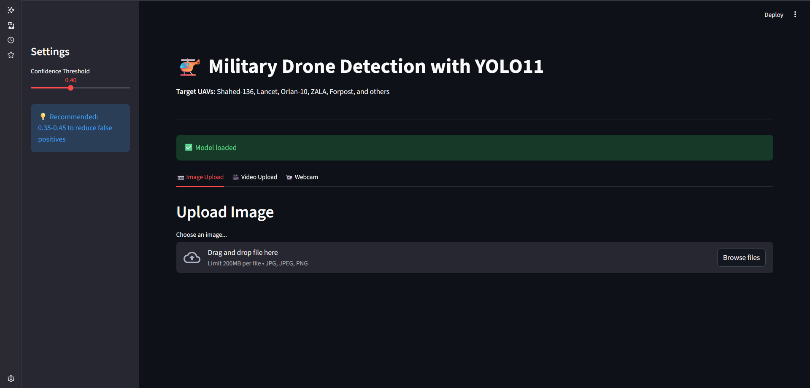
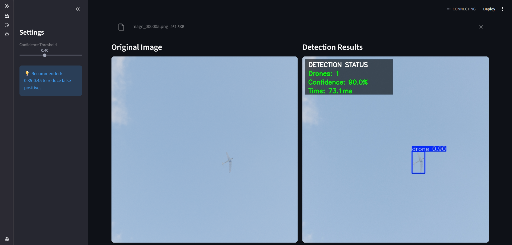
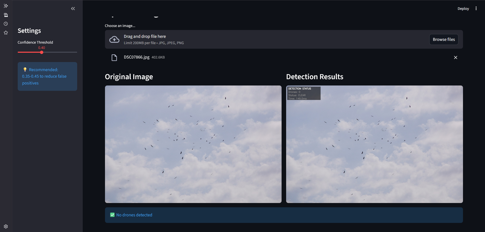

# Real-Time Military Drone Detection with YOLO11


A specialized detection system for identifying military unmanned aerial vehicles (UAVs) using the latest YOLO11 architecture. Trained on a synthetic dataset featuring combat drones including Shahed-136, Lancet, Orlan-10, and other reconnaissance and loitering munition platforms.

## Core Idea: Military UAV Detection

This project addresses a critical defense technology challenge: **automated detection of military drones in aerial surveillance systems**. Unlike commercial drone detection, military UAV identification requires handling specialized reconnaissance platforms, loitering munitions, and tactical drones designed for stealth and operational effectiveness.

The system employs **YOLO11n (You Only Look Once v11)**, fine-tuned on a fully synthetic dataset containing 14 distinct military drone types. The synthetic training approach ensures perfect annotation accuracy while covering a diverse range of UAV configurations, from small tactical drones to larger MALE (Medium Altitude Long Endurance) platforms.

## Detected UAV Types

The model is trained to identify the following military drone platforms:

-   **Shahed-131 / Shahed-136** (Iranian loitering munitions - "Geran" in Russian service)
-   **Lancet** (Russian loitering munition)
-   **Orlan-10** (Russian reconnaissance UAV)
-   **ZALA 421-16E / ZALA 421-04M** (Russian tactical reconnaissance)
-   **Forpost** (Russian MALE UAV)
-   **Mohajer** (Iranian reconnaissance platform)
-   **Granat-1 / Granat-2 / Granat-4** (Russian tactical UAV series)
-   **SuperCam** (Russian reconnaissance UAV)
-   **Techyon** (Commercial/tactical platform)
-   **DJI Mavic 3** (Commercial drone, military-adapted)

## Features

-   **Specialized Military UAV Detection:** Fine-tuned specifically for combat and reconnaissance drone platforms, not consumer quadcopters
-   **Synthetic Dataset Training:** Trained on perfectly annotated synthetic data generated with Blender, ensuring zero labeling errors
-   **Real-Time Performance:** Optimized for rapid detection with inference speeds suitable for operational deployment
-   **Multi-Modal Interface:** Three detection modes - static image analysis, video processing, and live webcam surveillance
-   **Comprehensive Web Interface:** Streamlit-based application for easy deployment and testing
-   **Production-Ready Pipeline:** Complete workflow from dataset preparation through training to deployment
-   **Adjustable Sensitivity:** Configurable confidence thresholds to balance detection rate vs. false alarm rate

## Getting Started

This project requires Python 3.11+ and uses `uv` for fast dependency management.

### 1. Clone the repository

```bash
git clone https://github.com/takzen/yolo-military-drone-detection.git
cd yolo-military-drone-detection
```

### 2. Install `uv` (if you don't have it)

```bash
pip install uv
```

### 3. Create environment and install dependencies

```bash
# Create the virtual environment
uv venv

# Activate the environment
# For Windows (PowerShell):
.\.venv\Scripts\activate
# For MacOS/Linux (bash/zsh):
source .venv/bin/activate

# Install all required packages
uv pip install ultralytics opencv-python streamlit pillow
```

### 4. Download the dataset

Download the military drones dataset from Kaggle:

**Dataset:** [banderastepan/drone-detection](https://www.kaggle.com/datasets/banderastepan/drone-detection)

```bash
# Option 1: Using Kaggle API
uv pip install kaggle
kaggle datasets download -d banderastepan/drone-detection
unzip drone-detection.zip -d drone-detection

# Option 2: Manual download
# Visit https://www.kaggle.com/datasets/banderastepan/drone-detection
# Download and extract to: drone-detection/
```

### 5. Train the model

```bash
python main.py
```

This will automatically:
-   Prepare the dataset (split into train/val/test)
-   Train YOLO11n for 100 epochs (~30-60 minutes on GPU)
-   Validate the model performance
-   Save the trained model to `results/military_drone_model/weights/best.pt`

### 6. Launch the application

```bash
streamlit run app.py
```

The application will open in your browser at `http://localhost:8501`.

---

## Application Workflow & Features

### Upload & Configure

The user interface provides:

-   **Image Upload:** Drag-and-drop support for JPG, JPEG, and PNG formats
-   **Video Processing:** Upload MP4, AVI, or MOV files for frame-by-frame detection
-   **Confidence Control:** Dynamic threshold adjustment (0.0-1.0) for detection sensitivity
-   **Real-Time Camera:** Live webcam integration for continuous surveillance

## Application Interface

### Main Control Panel


*Streamlit web interface with adjustable confidence threshold slider and three operation modes: Image Upload, Video Processing, and Real-time Webcam Detection.*

### Detection Examples

**Successful Military Drone Detection:**


*Military drone detected with high confidence (>80%). The overlay panel displays real-time statistics: drone count, confidence level, and inference time. Green status indicates active threat detection.*

**Robust Against False Positives:**


*System correctly ignores birds (storks) with confidence threshold set to 0.40. Gray "Status: CLEAR" indicates no UAV threats detected, demonstrating effective discrimination between natural aerial objects and military drones.*

### Detection Results

The application displays:

-   **Annotated Visualizations:** Bounding boxes drawn around detected UAVs
-   **Real-time Statistics Overlay:** Semi-transparent panel showing detection count, confidence, and inference time
-   **Color-coded Status:** Green for active detections, gray for clear skies
-   **Classification Labels:** "Drone" class identification with confidence scores
-   **Performance Metrics:** Inference timing, detection counts, and FPS monitoring
-   **Detection Statistics:** Tabular summary of all detected objects
-   **Video Export:** Download processed videos with burned-in annotations

---

## Technical Implementation

### Architecture Overview

The detection pipeline implements:

1.  **Dataset Preparation** → Synthetic dataset organization with train/val/test splits (80/15/5)
2.  **Data Loading** → YOLO format parsing with automatic verification
3.  **Model Training** → YOLO11n fine-tuning with specialized augmentation strategy
4.  **Inference Engine** → GPU-accelerated detection with configurable confidence filtering
5.  **Post-Processing** → Non-maximum suppression and bounding box extraction
6.  **Visualization** → OpenCV-based annotation rendering
7.  **Web Interface** → Streamlit multi-modal interaction layer

### Key Technologies

-   **YOLO11n Model:** Nano variant optimized for speed-accuracy balance (2.58M parameters, 6.3 GFLOPs)
-   **Synthetic Training Data:** Blender-generated imagery with perfect annotations
-   **Streamlit Framework:** Rapid prototyping framework for ML model deployment
-   **OpenCV (cv2):** Video I/O, frame processing, and visualization
-   **PyTorch Backend:** Deep learning framework powering YOLO11
-   **640x640 Resolution:** Standardized image size matching dataset specifications

### Training Configuration

Optimized parameters for military UAV detection:

```python
model.train(
    epochs=100,             # Extended training for accuracy
    imgsz=640,              # Matches dataset resolution
    batch=16,               # Optimized for 8GB VRAM
    device=0,               # CUDA GPU acceleration
    
    # Augmentation strategy
    hsv_h=0.015,           # Minimal hue shift
    hsv_s=0.7,             # Strong saturation variance
    hsv_v=0.5,             # Brightness (day/night simulation)
    degrees=10,            # Slight rotation (banking drones)
    scale=0.7,             # Multi-scale for distance variance
    flipud=0.0,            # No vertical flip
    fliplr=0.5,            # Horizontal flip enabled
    mosaic=1.0,            # Mosaic augmentation
    mixup=0.1,             # Mixup for robustness
    
    # Optimization
    optimizer='auto',       # Automatic selection
    lr0=0.01,              # Initial learning rate
    warmup_epochs=3,       # Warmup period
    amp=True,              # Mixed precision training
)
```

---

## Project Structure

```
yolo-military-drone-detection/
├── app.py                          # Streamlit web application
├── main.py                         # Training pipeline script
├── inspect_dataset.py              # Dataset structure analyzer
├── .gitignore                      # Git exclusion rules
├── README.md                       # Project documentation
├── images/                         # Images for readme.md
├── videos/                         # Videos for test app
├── drone-detection/                # Downloaded Kaggle dataset
│   ├── images/
│   └── labels/
├── military-drones-dataset/        # Prepared training dataset
│   ├── data.yaml                   # Dataset configuration
│   ├── train/
│   │   ├── images/
│   │   └── labels/
│   ├── valid/
│   │   ├── images/
│   │   └── labels/
│   └── test/
│       ├── images/
│       └── labels/
└── results/                        # Training outputs
    └── military_drone_model/
        ├── weights/
        │   └── best.pt             # Trained model checkpoint
        ├── results.png             # Training curves
        ├── confusion_matrix.png
        └── F1_curve.png
```

## Dataset Details

**Source:** Kaggle - banderastepan/drone-detection

**Characteristics:**
-   **Type:** Fully synthetic (Blender-generated)
-   **Resolution:** 640x640 pixels (standardized)
-   **Annotations:** YOLO format (`class_id center_x center_y width height`)
-   **Accuracy:** 100% annotation accuracy (synthetic generation)
-   **Classes:** Single class ("drone") covering 14 military UAV types
-   **Coverage:** Iranian, Russian, and commercial platforms

**Advantages of Synthetic Data:**
-   Perfect label accuracy (no human annotation errors)
-   Controlled lighting and environmental conditions
-   Diverse viewing angles and distances
-   No operational security concerns

## Configuration

### Model Selection

Switch to larger YOLO variants for improved accuracy (in `main.py`):

```python
model = YOLO('yolo11s.pt')  # Small: better accuracy, slower
model = YOLO('yolo11m.pt')  # Medium: balanced
model = YOLO('yolo11l.pt')  # Large: high accuracy
model = YOLO('yolo11x.pt')  # Extra large: maximum accuracy
```

### Training Duration

Adjust epochs for convergence:

```python
epochs=100  # Default: good balance
epochs=150  # Extended: better convergence
epochs=50   # Quick test training
```

### Detection Threshold

Modify confidence in `app.py`:

```python
confidence = st.sidebar.slider("Confidence", 0.1, 0.9, 0.25)
# Lower: more detections, higher false alarm rate
# Higher: fewer detections, lower false alarm rate
```

## Performance Results

Actual metrics achieved after training on military drones dataset:

| Metric | Score |
|--------|-------|
| mAP50 | 94.8% |
| mAP50-95 | 76.1% |
| Precision | 95.6% |
| Recall | 90.7% |
| Inference Speed | 2.7ms (GPU) |

**Interpretation:**
- **95.6% Precision:** When model detects a drone, it's correct 95.6% of the time (low false alarm rate)
- **90.7% Recall:** Successfully detects 9 out of 10 drones present in imagery
- **2.7ms Inference:** Capable of ~370 FPS processing speed on NVIDIA RTX 4060
- **Confidence threshold 0.40** recommended to eliminate false positives from birds and other aerial objects

## Learning Outcomes

This project demonstrates advanced capabilities in:

-   ✅ Training specialized object detection models for defense applications
-   ✅ Working with synthetic training data and understanding its advantages
-   ✅ Implementing domain-specific augmentation strategies
-   ✅ Building production ML pipelines from data preparation to deployment
-   ✅ GPU-accelerated model training and inference
-   ✅ Multi-modal inference systems (image/video/realtime)
-   ✅ Performance optimization for operational deployment
-   ✅ Modern ML engineering practices and workflow management

## Troubleshooting

### Dataset not found
Ensure you've downloaded and extracted the Kaggle dataset:
```bash
ls drone-detection/  # Should show images/ and labels/
```

### CUDA out of memory
Reduce batch size in `main.py`:
```python
batch=8  # or batch=4 for 4GB VRAM
```

### Low performance metrics
-   Increase training epochs to 150+
-   Try larger model variant (yolo11s or yolo11m)
-   Verify dataset quality with `python inspect_dataset.py`

### Slow inference
-   Ensure GPU is being used (check CUDA availability)
-   Export model to ONNX or TensorRT for deployment
-   Consider using smaller input size (imgsz=416)

## Future Enhancements

-   [ ] Multi-object tracking for continuous drone monitoring
-   [ ] Integration with radar/acoustic detection systems
-   [ ] Real-time alert system with configurable triggers
-   [ ] Drone trajectory prediction and threat assessment
-   [ ] Thermal/IR camera support for night operations
-   [ ] Edge deployment optimization (Jetson, Coral TPU)
-   [ ] Multi-class detection (drone type classification)
-   [ ] Integration with counter-UAS systems
-   [ ] Geospatial tracking and logging
-   [ ] Distributed detection network coordination

## Operational Considerations

**Disclaimer:** This is an educational/research project demonstrating computer vision techniques. Deployment in operational defense systems requires:

-   Validation on real-world imagery (not synthetic data alone)
-   Integration with existing command & control systems
-   Extensive field testing in various environmental conditions
-   Compliance with relevant regulations and protocols
-   Redundancy and failsafe mechanisms
-   Regular model updates as new UAV types emerge

## License

This project is licensed under the MIT License.

## Acknowledgments

-   **Ultralytics** for the YOLO11 implementation
-   **banderastepan** for creating and publishing the synthetic military drone dataset
-   **Streamlit** for the rapid application development framework
-   **Open source computer vision community** for continuous advancement of detection technologies